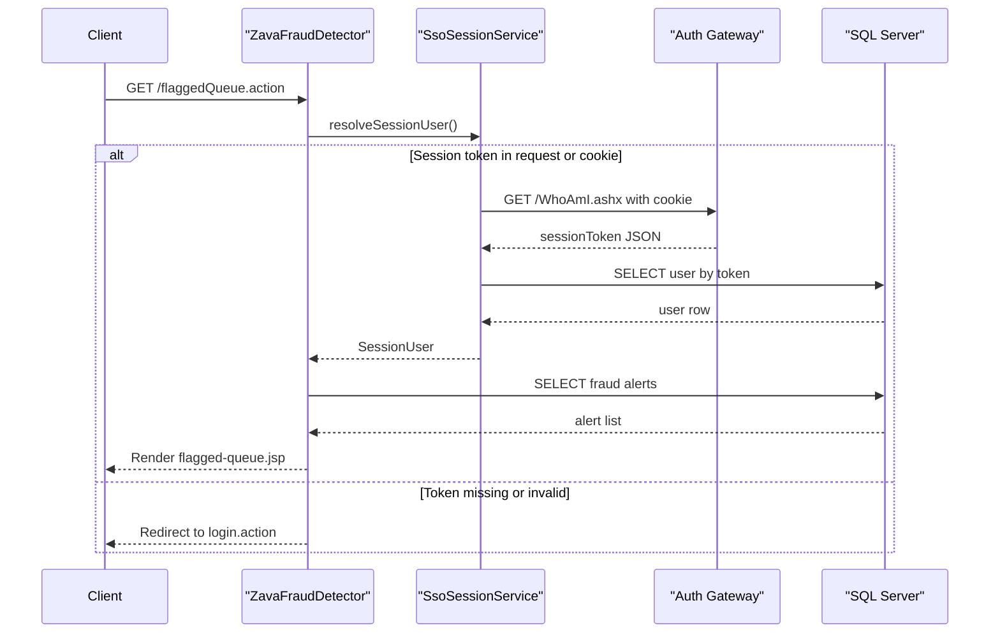

# API & Service Communication Contracts

The application exposes a server-rendered web action surface through Struts action routes and performs synchronous communication to SQL Server and an external auth gateway.

## Service Catalog

| Service | Port | Category | Purpose |
|---|---:|---|---|
| ZavaFraudDetector (WAR) | 8080 | Business | Fraud queue, rule management, and alert decisions |
| Zava Auth Gateway (external) | 8080 | Infrastructure | Resolves `.ZAVAAUTH` cookie to a session token |

## API Endpoints Inventory

| Service | Method | Path | Request Type | Response Type |
|---|---|---|---|---|
| ZavaFraudDetector | GET/POST | /login.action | sessionToken param | login.jsp or redirect |
| ZavaFraudDetector | GET | /flaggedQueue.action | session-based | flagged-queue.jsp |
| ZavaFraudDetector | GET | /transactionDetail.action | transactionId query | transaction-detail.jsp |
| ZavaFraudDetector | POST | /alertDecision.action | alertId, decision, notes | redirect to queue |
| ZavaFraudDetector | GET/POST | /ruleEdit.action /ruleSave.action | rule fields | rule form or redirect |
| ZavaFraudDetector | GET | /health.action | none | health.jsp |

## Management & Observability Endpoints

| Service | Endpoint | Custom Metrics |
|---|---|---|
| ZavaFraudDetector | /health.action | None detected |

## DTOs & Contracts

Primary API contract models include `SessionUser`, `FraudAlertRecord`, and `FraudRuleRecord`. Actions exchange request parameters and render JSP views; no OpenAPI, protobuf, or GraphQL contracts were detected.

## Communication Patterns

Communication is synchronous: browser-to-Struts actions, actions-to-SQL Server through JDBC, and session resolution to WhoAmI through HTTP. Retry/circuit-breaker frameworks are not configured. API-level transport security and token validation are partially present (session token/cookie checks), but no explicit TLS enforcement is configured in this codebase.

## Service Technology Matrix

| Service | Web | Data Access | Discovery | Gateway | Actuator | Cache | Metrics |
|---|---|---|---|---|---|---|---|
| ZavaFraudDetector | Struts 2 | JDBC | None | No | Health action only | None detected | None detected |
| Zava Auth Gateway | External HTTP endpoint | N/A | None | N/A | Unknown | Unknown | Unknown |

## Service Communication Sequence

