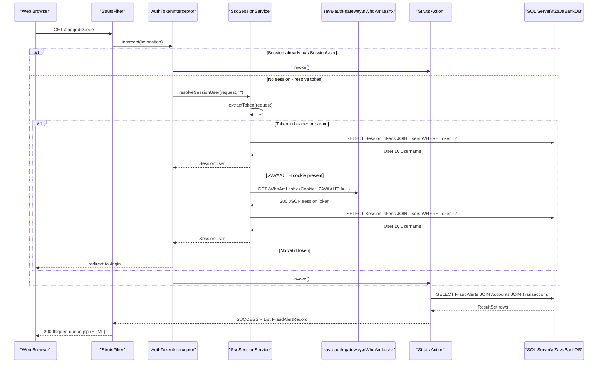

# API & Service Communication Contracts

ZavaFraudDetector exposes 9 Struts 2 action-based endpoints as a single monolithic WAR with no REST API or API gateway; all communication is synchronous HTTP with server-side JSP rendering.

## Service Catalog

| Service | Port | Category | Purpose |
|---------|------|----------|---------|
| ZavaFraudDetector (WAR) | 8080 | Business | Fraud alert review queue, transaction detail, alert decisions, and fraud rule management |
| zava-auth-gateway | 8080 (ext.) | Infrastructure | .NET SSO gateway; resolves `.ZAVAAUTH` FormsAuth cookies to session tokens via `WhoAmI.ashx` |

## API Endpoints Inventory

Struts 2 maps actions to URLs using the pattern `/{actionName}.action` (or without the suffix depending on configuration). All endpoints accept both GET and POST; the framework parameters drive action method selection.

| Service | Method | Path | Request Params | Response |
|---------|--------|------|----------------|----------|
| ZavaFraudDetector | GET/POST | `/login` | `sessionToken` (optional query/form param) | JSP: `login.jsp` or redirect to `flaggedQueue` |
| ZavaFraudDetector | GET | `/flaggedQueue` | _(none)_ | JSP: `flagged-queue.jsp` with `List<FraudAlertRecord>` |
| ZavaFraudDetector | GET | `/transactionDetail` | `alertId` (int, query param) | JSP: `transaction-detail.jsp` with `FraudAlertRecord`, or redirect to `flaggedQueue` |
| ZavaFraudDetector | POST | `/alertDecision` | `alertId` (int), `decision` (String), `notes` (String) | Redirect to `flaggedQueue` |
| ZavaFraudDetector | GET | `/rules` | _(none)_ | JSP: `rules.jsp` with `List<FraudRuleRecord>` |
| ZavaFraudDetector | GET | `/ruleEdit` | `ruleId` (int, optional) | JSP: `rule-form.jsp` with `FraudRuleRecord` (or empty for new) |
| ZavaFraudDetector | POST | `/ruleSave` | `ruleId`, `ruleName`, `ruleDescription`, `ruleExpression`, `severity`, `thresholdAmount`, `timeWindowMinutes`, `active` | Redirect to `rules` or re-render `rule-form.jsp` on validation failure |
| ZavaFraudDetector | POST | `/ruleDelete` | `ruleId` (int) | Redirect to `rules` |
| ZavaFraudDetector | GET | `/health` | _(none)_ | JSP: `health.jsp` (static "Online" page; bypasses `AuthTokenInterceptor`) |

## Management & Observability Endpoints

| Service | Endpoint | Details |
|---------|----------|---------|
| ZavaFraudDetector | `GET /health` | Static HTML response; no DB check, no actuator, no metrics. Bypasses `AuthTokenInterceptor` via Struts interceptor stack override. |

No Spring Boot Actuator, Micrometer, OpenTelemetry, or custom metric registrations are present. The application has no structured health check (liveness/readiness probe) beyond the static `/health` JSP page.

## DTOs & Contracts

There is no formal OpenAPI/Swagger specification, protobuf schema, or GraphQL schema. Serialization between browser and server is handled entirely by Struts 2's built-in OGNL value stack and JSP tag libraries (no Jackson, no JSON responses).

**Service-level model classes:**

| Class | API Role | Mutability |
|-------|----------|-----------|
| `FraudAlertRecord` | Response model for flagged queue and transaction detail views | Mutable POJO (setters) |
| `FraudRuleRecord` | Response model for rule list and rule edit form | Mutable POJO (setters) |
| `SessionUser` | Session-stored authenticated principal; read by all actions | Immutable (constructor-initialized, no setters) |

Action classes (e.g., `RuleEditAction`, `AlertDecisionAction`) also serve as both controller and form-backing bean; their fields are directly bound by Struts 2 parameter interceptors from HTTP request parameters.

For field-level details, see `data-architecture.md`.

## Communication Patterns

**Synchronous HTTP (inbound):** All client interactions are synchronous HTTP request/response via Struts 2 dispatcher filter. No reactive or async processing.

**Synchronous HTTP (outbound):** `SsoSessionService` makes a blocking HTTP GET to `http://zava-auth-gateway:8080/WhoAmI.ashx` using `java.net.HttpURLConnection` with a hardcoded 3-second connect and read timeout. This call occurs on every unauthenticated request before a valid session is found.

**No asynchronous messaging:** There is no Kafka, RabbitMQ, Azure Service Bus, or any event-driven pattern.

**Resilience:** The only resilience configuration is the 3-second connect/read timeout on the `WhoAmI.ashx` call. There is no circuit breaker (Resilience4j, Hystrix), retry policy, or bulkhead. A slow or unavailable auth gateway will block the request thread for up to 6 seconds before silently returning an empty token and failing authentication.

**Service discovery:** None. The auth gateway URL is hardcoded via the `auth.gateway.whoami.url` property (`http://zava-auth-gateway:8080/WhoAmI.ashx`). The SQL Server host is similarly resolved from a property/environment variable. There is no Eureka, Consul, or Kubernetes DNS service discovery abstraction.

**Security posture:** The application runs over plain HTTP with no TLS/HTTPS configuration present in the WAR. Authentication is enforced by `AuthTokenInterceptor` for all actions except `/login` and `/health`. Authorization is session-based only—any authenticated user has access to all features (no role-based access control, no `@PreAuthorize`, no fine-grained permission checks). The session token is validated against the `SessionTokens` table in SQL Server on each unauthenticated request.

## Service Technology Matrix

| Service | Web | Data Access | Discovery | Gateway | Health Check | Cache | Metrics |
|---------|-----|-------------|-----------|---------|--------------|-------|---------|
| ZavaFraudDetector | Struts 2 + JSP | Direct JDBC | None | None | Static JSP `/health` | None | None |
| zava-auth-gateway | .NET (external) | Unknown | None | None | Unknown | Unknown | Unknown |

## Service Communication Sequence

