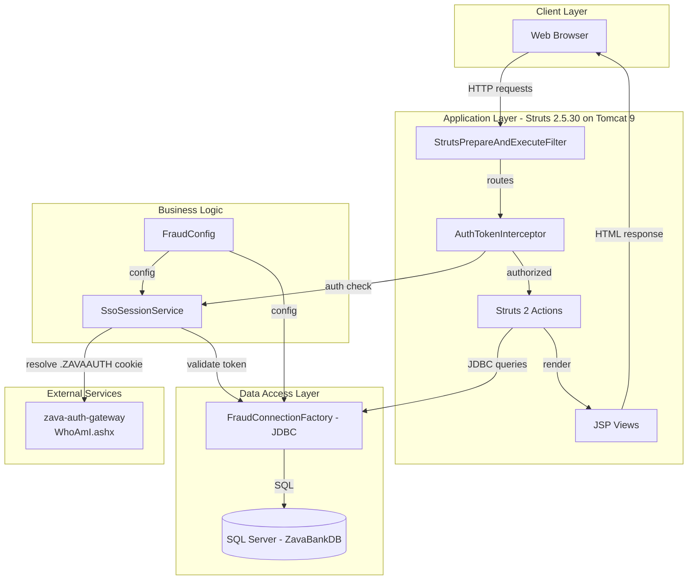
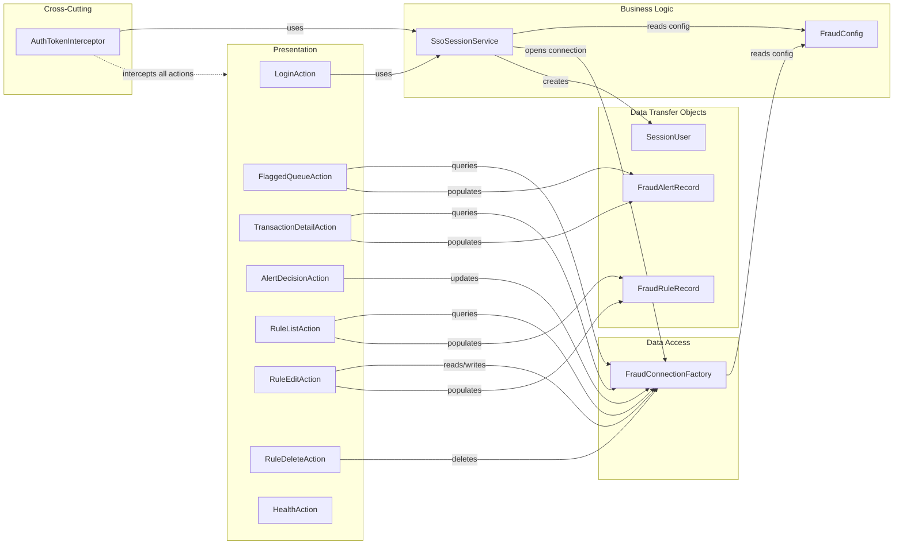

# Architecture Diagram

ZavaFraudDetector is a Java EE web application built with Apache Struts 2, deployed as a WAR on Tomcat 9, using direct JDBC to SQL Server and an external SSO auth gateway for authentication.

## Application Architecture

### Technology Stack Summary

| Layer | Technology | Version | Purpose |
|-------|-----------|---------|---------|
| Presentation | Apache Struts 2 + JSP | 2.5.30 | MVC web framework, server-side rendering |
| Web Container | Apache Tomcat | 9.0 | Servlet container hosting the WAR |
| Business Logic | Plain Java | 11 | Fraud alert review, rule management |
| Authentication | SsoSessionService + AuthTokenInterceptor | Custom | SSO token resolution via external gateway |
| Data Access | JDBC (mssql-jdbc) | 12.8.1 | Direct SQL Server access, no ORM |
| Database | Microsoft SQL Server | — | Persistent storage for alerts, transactions, rules |
| Build | Gradle | 7.6 (JDK 11) | WAR packaging |
| Containerization | Docker | — | Multi-stage build deploying to Tomcat 9 image |

### Data Storage & External Services

The application uses a single Microsoft SQL Server database (`ZavaBankDB`) accessed via direct JDBC with the Microsoft JDBC driver. There is no ORM or connection pool library—each action opens a JDBC connection through `FraudConnectionFactory` using credentials resolved from either environment variables or the `frauddetector.properties` file. The external dependency is the `zava-auth-gateway` service (a .NET application), whose `WhoAmI.ashx` endpoint is called over HTTP to resolve `.ZAVAAUTH` FormsAuthentication cookies into session tokens when the Java application cannot decrypt them natively.

### Key Architectural Decisions

- **Direct JDBC without ORM**: All database interactions use raw `PreparedStatement` calls, avoiding any ORM framework (Hibernate, EclipseLink), which simplifies the dependency footprint but requires manual SQL management.
- **Struts 2 interceptor for cross-cutting auth**: Authentication is enforced via a custom `AuthTokenInterceptor` injected into the Struts interceptor stack, keeping auth logic separate from business actions.
- **Dual-source configuration**: `FraudConfig` reads from environment variables first and falls back to `frauddetector.properties`, enabling container-native deployment without code changes.

## Component Relationships

### Component Inventory

| Component | Layer | Type | Responsibility |
|-----------|-------|------|---------------|
| LoginAction | Presentation | Struts Action | Handles SSO login and session establishment |
| FlaggedQueueAction | Presentation | Struts Action | Retrieves and displays pending fraud alerts |
| TransactionDetailAction | Presentation | Struts Action | Displays detail of a single fraud alert/transaction |
| AlertDecisionAction | Presentation | Struts Action | Records approve/reject decisions on fraud alerts |
| RuleListAction | Presentation | Struts Action | Lists all fraud detection rules |
| RuleEditAction | Presentation | Struts Action | Creates and edits fraud detection rules |
| RuleDeleteAction | Presentation | Struts Action | Deletes a fraud detection rule |
| HealthAction | Presentation | Struts Action | Exposes health check endpoint (bypasses auth) |
| AuthTokenInterceptor | Cross-Cutting | Struts Interceptor | Enforces authentication on all actions except login/health |
| SsoSessionService | Business Logic | Service | Resolves session tokens from request (header, cookie, WhoAmI gateway) |
| FraudConfig | Business Logic | Configuration | Provides database and SSO config from env vars or properties file |
| FraudConnectionFactory | Data Access | JDBC Factory | Opens SQL Server connections using configured credentials |
| SessionUser | DTOs | DTO | Carries authenticated user ID and username in HTTP session |
| FraudAlertRecord | DTOs | DTO | Carries fraud alert data between DB and JSP views |
| FraudRuleRecord | DTOs | DTO | Carries fraud rule data between DB and JSP views |
