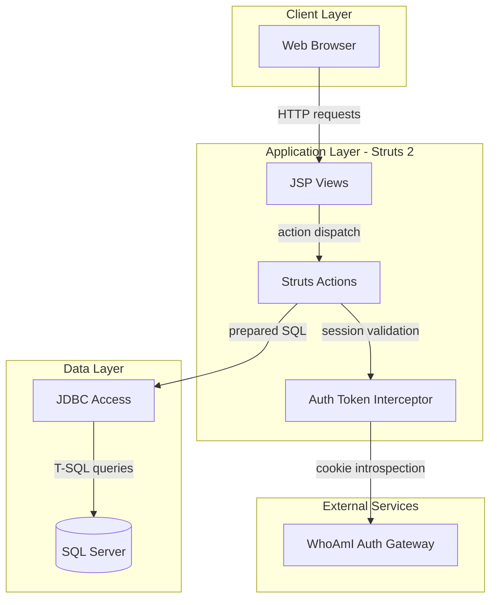
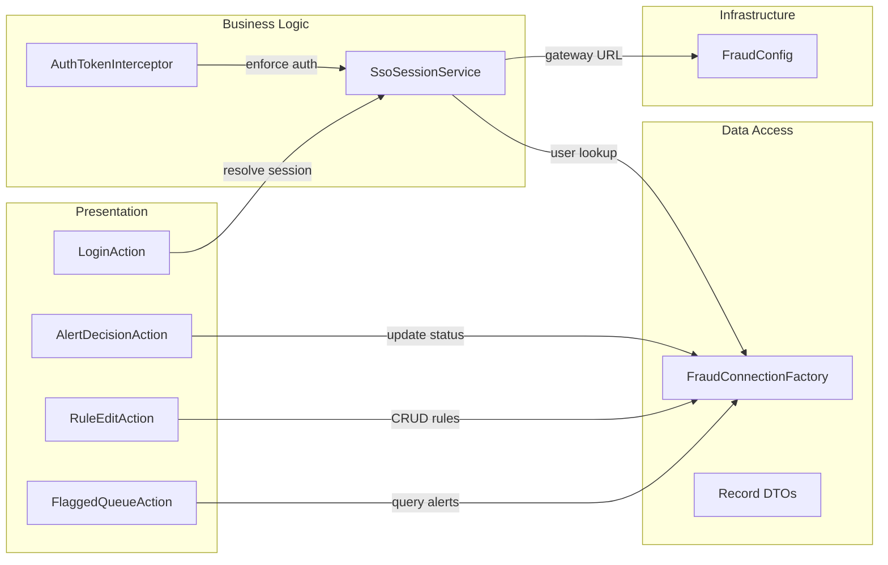

# Architecture Diagram

ZavaFraudDetector is a Struts-based web application packaged as a WAR and deployed on Tomcat, with direct SQL Server access and an external SSO gateway dependency.

## Application Architecture

### Technology Stack Summary

| Layer | Technology | Version | Purpose |
|---|---|---|---|
| Presentation | JSP + Struts Actions | Struts 2.5.30 | UI and request routing |
| Business Logic | Java services/actions | Java 11 | Fraud workflow orchestration |
| Data | JDBC + SQL Server driver | mssql-jdbc 12.8.1.jre11 | Persist and query fraud data |
| Runtime | Tomcat WAR deployment | Tomcat 9 | Servlet hosting |

### Data Storage & External Services

The application stores operational fraud data in SQL Server and calls an external authentication gateway to resolve SSO session tokens from a cookie.

### Key Architectural Decisions

- Uses Struts interceptor-based authentication before most actions.
- Uses direct JDBC with prepared statements instead of an ORM layer.
- Uses an external WhoAmI service to bridge .NET cookie authentication.

## Component Relationships

### Component Inventory

| Component | Layer | Type | Responsibility |
|---|---|---|---|
| AuthTokenInterceptor | Business Logic | Struts Interceptor | Authenticates session before protected actions |
| LoginAction | Presentation | Struts Action | Performs token-based login and session initialization |
| FlaggedQueueAction | Presentation | Struts Action | Lists active fraud alerts |
| RuleEditAction | Presentation | Struts Action | Creates/updates fraud rules |
| FraudConnectionFactory | Data Access | Utility | Opens SQL Server connections |
| SsoSessionService | Business Logic | Service | Resolves user identity from token/cookie |
