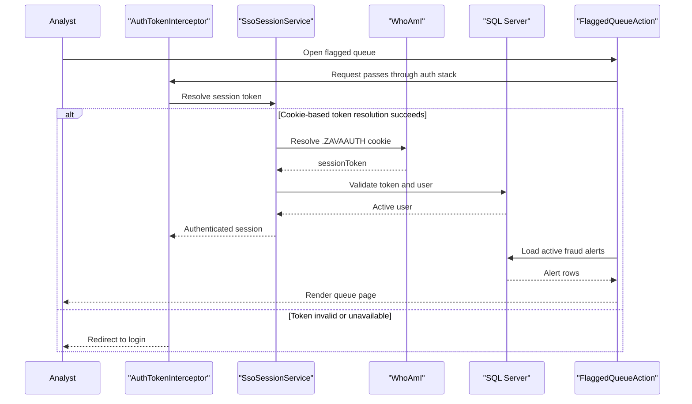

# Core Business Workflows

The application supports fraud operations analysts by authenticating users, surfacing suspicious transactions, and enabling alert decisions and rule maintenance.

## Domain Entities

| Entity | Service or Bounded Context | Description | Key Relationships |
|---|---|---|---|
| SessionUser | Access Control | Authenticated analyst session identity | Resolved from SessionTokens and Users |
| FraudAlertRecord | Fraud Monitoring | Represents a flagged transaction alert | Linked to transactions/accounts |
| FraudRuleRecord | Rule Management | Fraud detection rule metadata | Governs alert behavior |
| Transaction (DB) | Transaction Monitoring | Financial transaction under review | Linked to account and alerts |

## Service-to-Domain Mapping

| Service | Domain Context | Owned Entities | External Dependencies |
|---|---|---|---|
| ZavaFraudDetector | Fraud Monitoring and Rule Management | SessionUser, FraudAlertRecord, FraudRuleRecord | SQL Server, auth gateway |

## Primary Workflows

### Workflow 1: Analyst Authentication and Queue Access

User accesses a protected action, interceptor resolves session token from parameter/header/cookie, application verifies token against DB, then returns fraud queue for authenticated users.

### Workflow 2: Alert Triage Decision

Analyst opens transaction details and submits approve/reject decision. The action updates alert status and resolution notes, then redirects back to the flagged queue.

### Workflow 3: Fraud Rule Maintenance

Analyst loads an existing rule or creates a new one, validates key fields (rule name and severity), then persists updates in FraudRules.

## Cross-Service Data Flows

The deployable component combines identity data from the external WhoAmI gateway with relational fraud data from SQL Server. If gateway resolution fails, user flow degrades to login prompt instead of queue access.

## Business Workflow Sequence

## Business Rules & Decision Logic

- Queue shows alerts in `New` or `InReview` status ordered by most recent creation date.
- Alert decision maps input to `Approved` or `Rejected` and appends analyst identity to resolution notes.
- Rule save requires a non-empty rule name and severity; invalid numeric fields block persistence.
- Session validity depends on token activity and expiry checks in the `SessionTokens` table.
