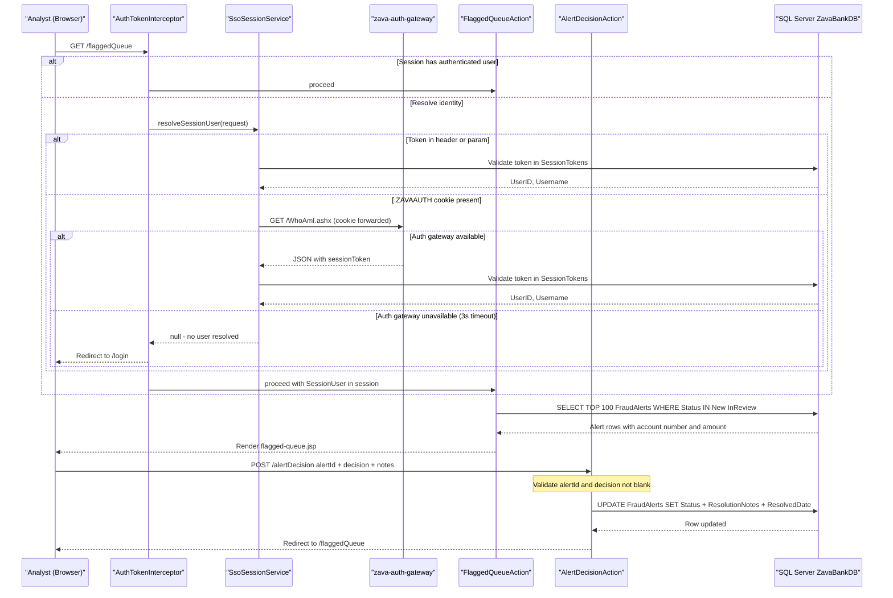

# Core Business Workflows

ZavaFraudDetector is an analyst-facing fraud review tool for ZavaBank, enabling security analysts to inspect flagged bank transactions, make approve-or-reject decisions, and manage the fraud detection rules that drive alert generation.

## Domain Entities

| Entity | Service / Bounded Context | Description | Key Relationships |
|--------|--------------------------|-------------|------------------|
| FraudAlert | Fraud Review | A pending or resolved fraud flag raised against an account transaction | Belongs to an Account; references a Transaction; governed by FraudRules |
| Transaction | Fraud Review | A bank transaction (amount, ID) referenced by a fraud alert | Associated with one or more FraudAlerts |
| Account | Fraud Review | A bank account identified by its account number | Linked to FraudAlerts for context |
| FraudRule | Rule Management | A named detection rule with expression, severity, threshold, and time window | Governs which transactions are flagged (alerts reference the rule that triggered them) |
| User | Authentication | A system analyst with a username and active/inactive status | Owns SessionTokens; identified in ResolutionNotes on alert decisions |
| SessionToken | Authentication | A time-limited authentication token mapped to a User | Issued and managed by the external auth gateway; validated against the database |

## Service-to-Domain Mapping

| Service | Domain Context | Owned Entities | External Dependencies |
|---------|---------------|----------------|-----------------------|
| ZavaFraudDetector (WAR) | Fraud Alert Review + Rule Management | FraudAlert, Transaction, Account, FraudRule, User, SessionToken | zava-auth-gateway (WhoAmI.ashx) — SSO cookie resolution |
| zava-auth-gateway (external) | Authentication / SSO | Manages `.ZAVAAUTH` FormsAuth cookies | None visible from this application |

Because this is a monolith, all bounded contexts share the same database and codebase. There is no formal DDD module separation.

## Primary Workflows

### Workflow 1: Analyst Authentication

An analyst accesses any protected page. The `AuthTokenInterceptor` checks the current HTTP session for an authenticated `SessionUser`. If absent, it attempts to resolve an identity from:
1. A `sessionToken` query parameter or `X-Session-Token` header
2. A `Bearer` token in the `Authorization` header
3. A `.ZAVAAUTH` FormsAuth cookie — if present, the interceptor calls the external WhoAmI gateway over HTTP to obtain a session token, then validates that token against the `SessionTokens` database table

If resolution succeeds the `SessionUser` is stored in the HTTP session and the original request proceeds. If resolution fails the analyst is redirected to `/login`, where they can supply a session token manually.

### Workflow 2: Fraud Alert Queue Review

An authenticated analyst opens the fraud queue (`/flaggedQueue`). The application queries the most recent 100 `FraudAlerts` with status `New` or `InReview`, joining `Accounts` (account number) and `Transactions` (amount), ordered by creation date descending. The rendered page shows alert ID, type, severity, status, account number, amount, and creation timestamp.

### Workflow 3: Transaction Detail Investigation

From the queue, the analyst clicks an alert to navigate to `/transactionDetail?alertId=<id>`. The application loads the single alert record with its account and transaction context. If the alert ID is missing or not found, the analyst is redirected back to the queue.

### Workflow 4: Alert Decision (Approve / Reject)

The analyst submits a decision via `/alertDecision` (POST) with `alertId`, `decision` (`Approved` or `Rejected`), and optional `notes`. The application:
1. Resolves the authenticated analyst's username from the HTTP session
2. Builds a `ResolutionNotes` string: `<analyst notes> | Decision by <username>` (notes omitted if blank)
3. Maps the decision string to `Approved` or `Rejected` status
4. Updates `FraudAlerts.Status`, `ResolutionNotes`, `ResolvedDate`, and `ModifiedDate` in a single `UPDATE` statement
5. Redirects the analyst back to the queue

If `alertId` or `decision` is absent, the action returns silently without updating the database.

### Workflow 5: Fraud Rule Management

Analysts can list all rules (`/rules`), create or edit a rule (`/ruleEdit`, `/ruleSave`), and delete a rule (`/ruleDelete`). Each rule has a name, optional description and expression, severity, optional threshold amount, optional time window in minutes, and an active/inactive flag. On save, the application validates that name and severity are non-empty and that threshold amount and time window parse as valid numbers before writing to the database. Hard deletion is performed with no soft-delete or audit trail.

## Cross-Service Data Flows

The only cross-service data flow is the SSO token resolution path. When a `.ZAVAAUTH` cookie is present and no valid session exists, `SsoSessionService` calls `http://zava-auth-gateway:8080/WhoAmI.ashx` over HTTP with the cookie forwarded. The gateway returns a JSON response from which the session token field is extracted using a simple string search (no JSON library). That token is then validated locally against the `SessionTokens` table.

**Fallback behavior:** If the auth gateway is unavailable or returns a non-200 status, the call fails silently within a 3-second timeout. The analyst is redirected to the login page, where they can enter their session token manually. No circuit breaker or retry is in place — all request threads are blocked for up to 6 seconds (3 s connect + 3 s read) before the fallback occurs.

There is no other inter-service data composition. All fraud alert, transaction, account, and rule data is read directly from the shared SQL Server database.

## Business Workflow Sequence



## Business Rules & Decision Logic

### Validation Rules

| Location | Rule |
|----------|------|
| `AlertDecisionAction` | If `alertId` is null or `decision` is blank, the action exits silently without updating the database |
| `AlertDecisionAction` | Decision is normalized: any value case-insensitively equal to `Approved` → `Approved`; everything else → `Rejected` |
| `RuleEditAction.save()` | Rule name is required (non-null, non-blank) |
| `RuleEditAction.save()` | Severity is required (non-null, non-blank) |
| `RuleEditAction.save()` | `thresholdAmount` must parse as `BigDecimal` if non-empty |
| `RuleEditAction.save()` | `timeWindowMinutes` must parse as `int` if non-empty |
| `SsoSessionService` | Session token must exist in `SessionTokens`, have `IsActive=1`, have `ExpiresAt > GETDATE()`, and join to a `User` with `IsActive=1` |

### State Transitions

`FraudAlert.Status` lifecycle:

```
[New] ──────────────────── AlertDecision(Approved) ──► [Approved]
[New] ──────────────────── AlertDecision(Rejected) ──► [Rejected]
[InReview] ─────────────── AlertDecision(Approved) ──► [Approved]
[InReview] ─────────────── AlertDecision(Rejected) ──► [Rejected]
```

Only `New` and `InReview` alerts appear in the queue. No transition from `New` to `InReview` is implemented in this application — that transition is presumably driven by an external fraud-detection system.

### Cross-Cutting Concerns

- **Transactions:** No JDBC transaction management is configured. Each action opens its own connection for a single `PreparedStatement` and relies on auto-commit. Multi-step operations are not atomic.
- **Authorization:** Any authenticated analyst has access to all actions — there is no role-based access control. Alert decisions and rule deletions are not restricted to privileged roles.
- **Audit trail:** The `ResolutionNotes` field embeds the analyst username and optional free-text note. No separate audit log table or event publishing exists.
- **Error handling:** SQL exceptions are caught per action and surfaced as Struts 2 action errors rendered to the JSP; no compensating actions or dead-letter handling.
- **Rule hard-delete:** Fraud rules are permanently deleted with `DELETE FROM FraudRules WHERE RuleID=?`; no soft-delete, archive, or audit record is created.
