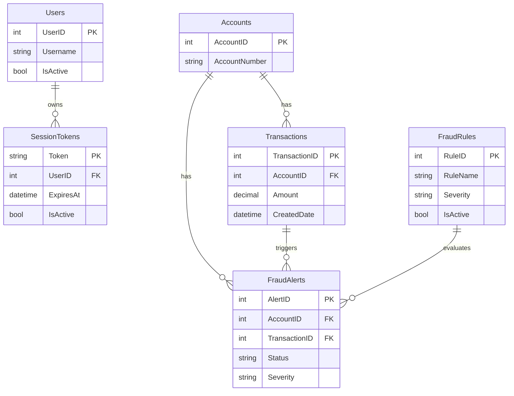

# Data Architecture & Persistence Layer

The persistence layer is centered on SQL Server accessed through direct JDBC statements, with record-style Java model classes used for transfer to JSP views.

## Database Configuration

| Service or Module | DB Type | Profile | Driver | Connection | Migration Tool |
|---|---|---|---|---|---|
| ZavaFraudDetector | SQL Server | Default | com.microsoft.sqlserver:mssql-jdbc | JDBC URL from `frauddetector.properties` | None detected |

## Data Ownership per Service

| Service | Tables Owned | ORM Framework | Caching | Notes |
|---|---|---|---|---|
| ZavaFraudDetector | SessionTokens, Users, FraudAlerts, FraudRules, Transactions, Accounts | Direct JDBC (no ORM) | None detected | Single shared relational schema |

## Entity Model

## Key Repository Methods

| Service | Repository | Notable Methods | Purpose |
|---|---|---|---|
| ZavaFraudDetector | `FraudConnectionFactory` + action SQL | Prepared `SELECT` for queue, token lookup, rule lookup; prepared `UPDATE`/`INSERT` for decisions/rules | Core fraud read/write operations and auth session resolution |

## Caching Strategy

No explicit cache provider or cache-aside/read-through pattern was identified in the codebase.

## Data Ownership Boundaries

The application uses a single shared SQL Server schema and directly queries tables needed by each action. There is no separate service-owned database boundary; read and write access occur within one deployable component.

### Data Classification & Sensitivity

| Entity | Sensitive Fields | Classification | Controls in Place |
|---|---|---|---|
| Users | Username | PII | Session-based access checks |
| Accounts | AccountNumber | Confidential | No field-level masking detected |
| FraudAlerts | ResolutionNotes | Internal | No explicit encryption controls in app code |
| SessionTokens | Token | Confidential | Token expiry and active checks in query |
