# Data Architecture & Persistence Layer

ZavaFraudDetector accesses a single Microsoft SQL Server database (`ZavaBankDB`) using plain JDBC with no ORM framework, no connection pool, and no migration tooling; the schema is inferred from raw SQL statements embedded in action and service classes.

## Database Configuration

| Service/Module | DB Type | Profile | Driver | Connection | Migration Tool |
|----------------|---------|---------|--------|------------|----------------|
| ZavaFraudDetector | Microsoft SQL Server | Single (no profiles) | `mssql-jdbc 12.8.1.jre11` | `jdbc:sqlserver://<host>:<port>;databaseName=ZavaBankDB;encrypt=false;trustServerCertificate=true` via `DriverManager.getConnection()` — no connection pool | None — schema must be managed externally |

Connection credentials and host are resolved at runtime from environment variables (`DB_HOST`, `DB_PORT`, `DB_NAME`, `DB_USER`, `DB_PASSWORD`) with fallback to `frauddetector.properties`. TLS encryption is explicitly disabled in the JDBC connection string (`encrypt=false`). There is no Flyway, Liquibase, or any migration framework; schema creation and seeding are entirely the operator's responsibility.

## Data Ownership per Service

| Service | Tables Owned | ORM Framework | Caching | Notes |
|---------|-------------|---------------|---------|-------|
| ZavaFraudDetector | FraudAlerts, Transactions, Accounts, FraudRules, Users, SessionTokens | None — raw JDBC (PreparedStatement) | None | All tables in a single shared `ZavaBankDB` SQL Server database |

## Entity Model

> Note: No JPA/ORM entities or schema files exist. The entity model is reconstructed from SQL queries embedded in action and service classes.

```mermaid
erDiagram
    Users ||--o{ SessionTokens : "authenticates via"
    Users ||--o{ FraudAlerts : "resolves"
    Accounts ||--o{ FraudAlerts : "flagged in"
    Transactions ||--o{ FraudAlerts : "triggers"
    FraudRules ||--o{ FraudAlerts : "governs"

    Users {
        int UserID PK
        string Username
        bit IsActive
    }

    SessionTokens {
        string Token PK
        int UserID FK
        bit IsActive
        datetime ExpiresAt
    }

    Accounts {
        int AccountID PK
        string AccountNumber
    }

    Transactions {
        bigint TransactionID PK
        decimal Amount
    }

    FraudAlerts {
        int AlertID PK
        int AccountID FK
        bigint TransactionID FK
        int RuleID FK
        string AlertType
        string Severity
        string Status
        string Description
        string ResolutionNotes
        datetime CreatedDate
        datetime ResolvedDate
        datetime ModifiedDate
    }

    FraudRules {
        int RuleID PK
        string RuleName
        string RuleDescription
        string RuleExpression
        string Severity
        decimal ThresholdAmount
        int TimeWindowMinutes
        bit IsActive
        datetime CreatedDate
        datetime ModifiedDate
    }
```

## Key Repository Methods

There are no formal repository interfaces. All data access is implemented inline within action and service classes using `PreparedStatement`. The following table documents the significant query patterns:

| Caller Class | Operation | SQL Pattern | Purpose |
|-------------|-----------|-------------|---------|
| `SsoSessionService` | Token lookup | `SELECT TOP 1 st.UserID, u.Username FROM SessionTokens st INNER JOIN Users u … WHERE st.Token=? AND st.IsActive=1 AND st.ExpiresAt>GETDATE()` | Validates session token and retrieves authenticated user |
| `FlaggedQueueAction` | Alert list | `SELECT TOP 100 … FROM FraudAlerts fa LEFT JOIN Accounts LEFT JOIN Transactions WHERE fa.Status IN ('New','InReview') ORDER BY fa.CreatedDate DESC` | Loads pending fraud alert queue |
| `TransactionDetailAction` | Single alert | `SELECT TOP 1 … FROM FraudAlerts fa LEFT JOIN Accounts LEFT JOIN Transactions WHERE fa.AlertID=?` | Loads a single alert with account and transaction context |
| `AlertDecisionAction` | Alert update | `UPDATE FraudAlerts SET Status=?, ResolutionNotes=?, ResolvedDate=GETDATE(), ModifiedDate=GETDATE() WHERE AlertID=?` | Records approve/reject decision with auditor name |
| `RuleListAction` | Rule list | `SELECT … FROM FraudRules ORDER BY RuleID` | Loads all fraud detection rules |
| `RuleEditAction` | Rule read | `SELECT … FROM FraudRules WHERE RuleID=?` | Loads a single rule for editing |
| `RuleEditAction` | Rule insert | `INSERT INTO FraudRules … VALUES (…, GETDATE(), GETDATE())` | Creates a new fraud rule |
| `RuleEditAction` | Rule update | `UPDATE FraudRules SET … ModifiedDate=GETDATE() WHERE RuleID=?` | Updates an existing fraud rule |
| `RuleDeleteAction` | Rule delete | `DELETE FROM FraudRules WHERE RuleID=?` | Hard-deletes a fraud rule |

No transaction management annotations are used. Each action opens and closes its own JDBC connection per operation; there are no multi-statement transactions, meaning partial failures (e.g., during a multi-step update) cannot be rolled back.

## Caching Strategy

No caching layer is implemented. There is no EhCache, Redis, Caffeine, Spring Cache, or second-level Hibernate cache. Every page render triggers fresh SQL queries to SQL Server. The authenticated `SessionUser` is stored in the Struts 2 HTTP session (`javax.servlet.http.HttpSession`) between requests, which avoids repeated token-to-user lookups for already-authenticated sessions — but this is HTTP session state, not an application cache.

## Data Ownership Boundaries

ZavaFraudDetector is a single service with exclusive ownership of all six tables in `ZavaBankDB`. There is no database-per-service, schema-per-service, or cross-service data access. The `zava-auth-gateway` external service does not share this database; it communicates with the application only via the `WhoAmI.ashx` HTTP endpoint to validate `.ZAVAAUTH` cookies.

All read and write operations originate from the single WAR instance. There is no CQRS separation, read replica, or event sourcing. The `FraudAlerts` table functions as a shared mutable state that is both written by upstream fraud detection processes (outside this application's scope) and read/updated by this application's analysts.

### Data Classification & Sensitivity

| Entity/Table | Sensitive Fields | Classification | Controls in Place |
|-------------|-----------------|----------------|------------------|
| Users | `Username` | PII (user identifiers) | None — stored in plaintext, no masking |
| SessionTokens | `Token` | Security credential (session secret) | None — stored in plaintext in SQL Server; no hashing or encryption |
| Accounts | `AccountNumber` | PCI-adjacent (financial account identifier) | None — no encryption-at-rest, no masking |
| Transactions | `Amount` | Financial data | None — no encryption-at-rest |
| FraudAlerts | `Description`, `ResolutionNotes` | May contain PII/financial context | None — no encryption-at-rest or access control |
| FraudRules | _(none sensitive)_ | Internal operational data | N/A |

Session tokens are stored as plaintext in the `SessionTokens` table; a database read compromise directly yields valid authentication tokens. Account numbers are stored unmasked. The JDBC connection uses `encrypt=false`, meaning all data traverses the network in cleartext between the application and SQL Server.
