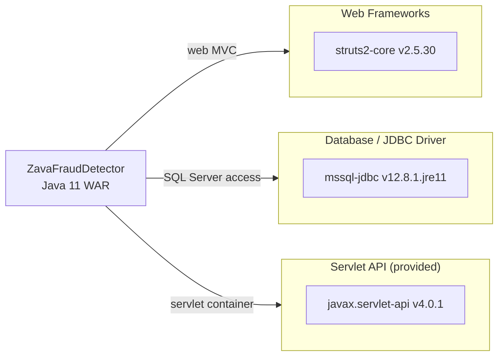

# Dependency Map

ZavaFraudDetector is a Gradle-built Java 11 WAR with 3 declared runtime/provided dependencies and no declared test dependencies.

## Dependencies

### Dependency Summary

| Category | Count | Key Libraries | Notes |
|----------|-------|--------------|-------|
| Web Frameworks | 1 | Apache Struts 2 v2.5.30 | Legacy MVC framework; 2.5.x branch is End-of-Life |
| Database / JDBC Driver | 1 | mssql-jdbc v12.8.1.jre11 | Current Microsoft JDBC driver for SQL Server |
| Servlet API (provided) | 1 | javax.servlet-api v4.0.1 | Provided by Tomcat 9 at runtime |

### Version & Compatibility Risks

Apache Struts 2.5.30 belongs to the 2.5.x maintenance branch, which reached End-of-Life on December 31, 2023. The Struts project recommends migrating to Struts 6.x or to a modern framework such as Spring MVC, Jakarta EE MVC, or Quarkus. The 2.x line has been the source of multiple critical CVEs (including the widely exploited S2-045 and S2-062 remote code execution vulnerabilities); staying on any 2.5.x release exposes the application to known, unpatched exploits. The `mssql-jdbc` driver at version 12.8.1 is current as of early 2025. The `javax.servlet-api 4.0.1` (Jakarta EE 8 namespace) is tied to Tomcat 9; migrating to Tomcat 10+ would require renaming all `javax.servlet` imports to `jakarta.servlet` throughout the codebase.

### Notable Observations

- **No connection pool declared**: Connections are obtained via `DriverManager.getConnection()` directly. There is no HikariCP, DBCP2, or Tomcat JDBC Pool, which means every request opens a raw TCP connection to SQL Server—a significant performance and reliability risk in production.
- **No explicit logging library**: Struts 2 core transitively brings in Apache Commons Logging and Log4j; without a pinned explicit dependency, the application inherits whatever transitive version Struts selects, creating a potential Log4Shell (CVE-2021-44228) exposure if Log4j 2 were pulled in indirectly.
- **No security library**: Authentication is entirely hand-rolled using raw JDBC queries and HTTP calls; there is no Spring Security, OIDC client, or token-validation library, increasing risk of implementation flaws.
- **Minimal dependency surface**: The extremely small declared dependency list (3 entries) keeps the direct attack surface low, but the Struts 2 transitive tree is large and historically CVE-prone.

## Test Dependencies

No test-scoped dependencies were declared in `build.gradle`.

Total test-scope dependencies: 0

No test framework (JUnit, Mockito, etc.) is declared in the build file, meaning there is no automated test suite. This is a significant gap for a financial fraud-detection application and should be addressed as part of any modernization effort.
