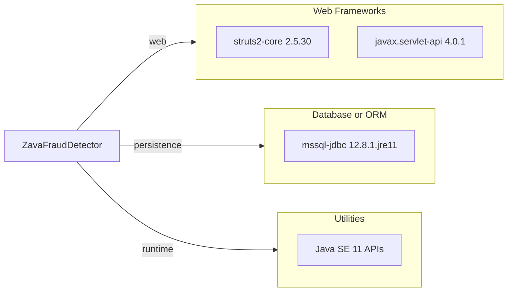

# Dependency Map

This Gradle-based Java web app declares a small runtime dependency set centered on Struts MVC and SQL Server connectivity.

## Dependencies

### Dependency Summary

| Category | Count | Key Libraries | Notes |
|---|---:|---|---|
| Web Frameworks | 2 | struts2-core, javax.servlet-api | Classic servlet MVC stack |
| Database or ORM | 1 | mssql-jdbc | SQL Server driver only |
| Utilities | 1 | Java SE APIs | No additional utility libraries |

### Version & Compatibility Risks

Struts 2.x and Java 11/Tomcat WAR deployment represent a legacy stack that may need additional modernization work for cloud-native migration targets.

### Notable Observations

- No test-scoped dependencies are declared in `build.gradle`.
- Data access is handled via raw JDBC instead of ORM libraries.
- Dependency footprint is small, reducing transitive risk complexity.

## Test Dependencies

| Framework | Version | Notes |
|---|---|---|
| None detected | N/A | No explicit test dependency declarations in build file |

Total test-scope dependencies: 0
No dedicated test framework dependency is currently declared.
