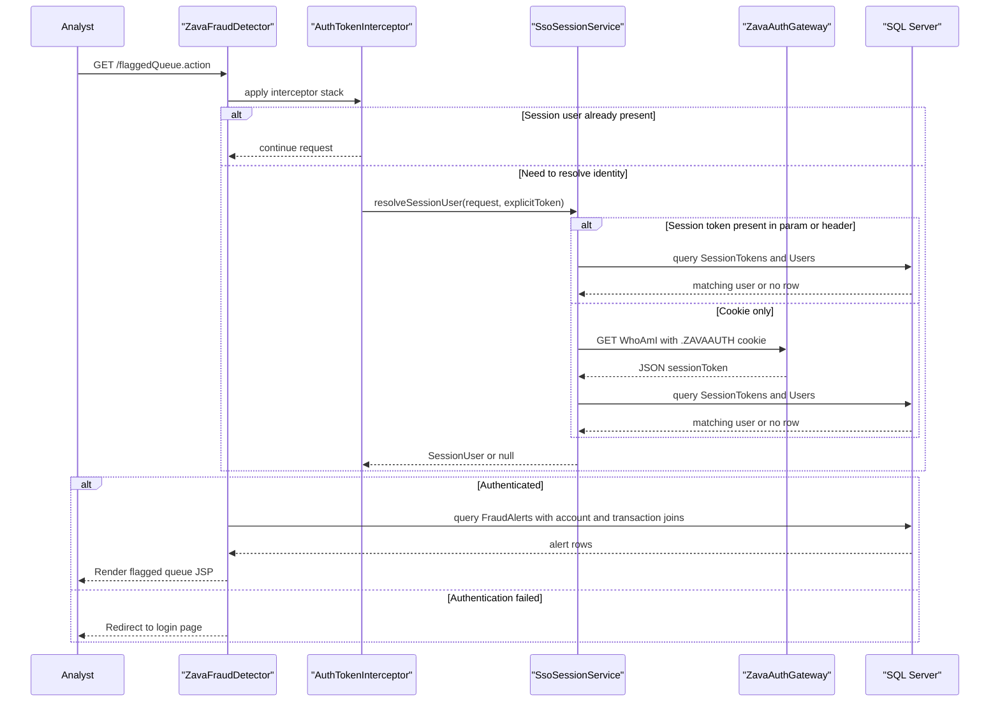

# API & Service Communication Contracts

The application exposes a small server-rendered HTTP surface built around Struts action endpoints. Communication is synchronous: browser requests reach the Java web app, which then talks directly to SQL Server and, for SSO cookie resolution, to an external authentication gateway.

## Service Catalog

| Service | Port | Category | Purpose |
|---|---:|---|---|
| ZavaFraudDetector | 8080 | API Layer | Fraud analyst dashboard for queue review and rule management |
| ZavaAuthGateway | 8080 | Infrastructure | Resolves `.ZAVAAUTH` cookies through `WhoAmI.ashx` |
| SQL Server | 1433 | Infrastructure | Stores alerts, rules, account data, transactions, and sessions |

## API Endpoints Inventory

| Service | Method | Path | Request Type | Response Type |
|---|---|---|---|---|
| ZavaFraudDetector | GET or POST | /login.action | `sessionToken` form field, query param, header, or cookie | Redirect to `flaggedQueue` or render login JSP |
| ZavaFraudDetector | GET | /flaggedQueue.action | Session-backed request | `FraudAlertRecord` list rendered in `flagged-queue.jsp` |
| ZavaFraudDetector | GET | /transactionDetail.action | `alertId` query parameter | Single `FraudAlertRecord` rendered in `transaction-detail.jsp` |
| ZavaFraudDetector | POST | /alertDecision.action | `alertId`, `decision`, `notes` form fields | Redirect to `flaggedQueue.action` |
| ZavaFraudDetector | GET | /rules.action | Session-backed request | `FraudRuleRecord` list rendered in `rules.jsp` |
| ZavaFraudDetector | GET | /ruleEdit.action | Optional `ruleId` query parameter | Rule editor JSP with existing data when `ruleId` is present |
| ZavaFraudDetector | POST | /ruleSave.action | Rule editor form fields | Redirect to `rules.action` or return validation errors |
| ZavaFraudDetector | GET | /ruleDelete.action | `ruleId` query parameter | Redirect to `rules.action` |
| ZavaFraudDetector | GET | /health.action | No request body | Static health JSP |

## Management & Observability Endpoints

| Service | Endpoint | Custom Metrics (if any) |
|---|---|---|
| ZavaFraudDetector | /health.action | None detected |

## DTOs & Contracts

The primary contract types are simple mutable POJOs rather than immutable DTOs. `FraudAlertRecord` represents queue and detail responses, `FraudRuleRecord` represents rule management screens, and `SessionUser` represents the authenticated analyst stored in the Struts session. No OpenAPI, Swagger, protobuf, or GraphQL contract definitions were found. Serialization is minimal; the only explicit remote response parsing is a manual JSON string lookup for `sessionToken` in `SsoSessionService`, while the browser-facing surface uses JSP rendering instead of JSON APIs.

## Communication Patterns

All application communication is synchronous. Browser requests are routed through Struts actions and most are intercepted by `AuthTokenInterceptor`, which either reuses a session user or calls `SsoSessionService` to validate a token. `SsoSessionService` checks tokens against SQL Server directly and can fall back to a hard-coded auth gateway URL to resolve the `.ZAVAAUTH` cookie. There is no asynchronous messaging, service discovery, retry framework, circuit breaker, or client-side load balancing. API-level security is limited to the custom interceptor and token lookup flow; no TLS termination, JWT support, or role-based authorization annotations were found, and the auth gateway URL uses HTTP.

## Service Technology Matrix

| Service | Web | Data Access | Discovery | Gateway | Actuator | Cache | Metrics |
|---|---|---|---|---|---|---|---|
| ZavaFraudDetector | Struts 2 and JSP | Direct JDBC | None | No | Custom health action only | None | None |
| ZavaAuthGateway | ASP.NET endpoint consumer only | N/A | None | Auth helper | Unknown | None | None |
| SQL Server | N/A | N/A | None | No | N/A | N/A | N/A |

## Service Communication Sequence

