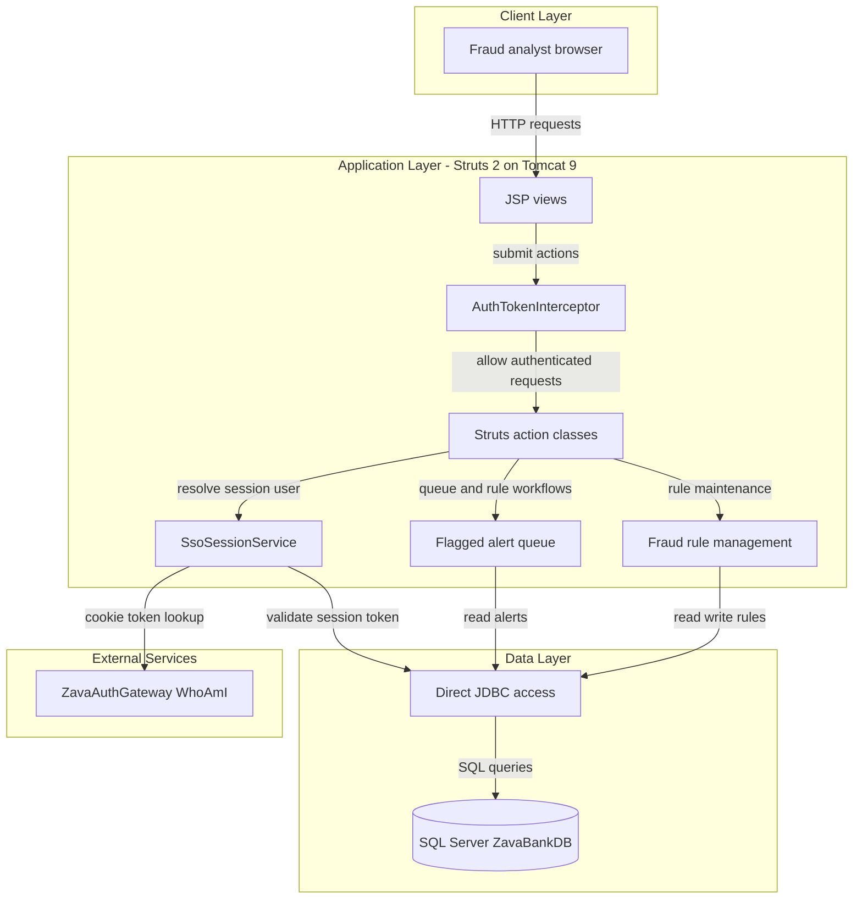
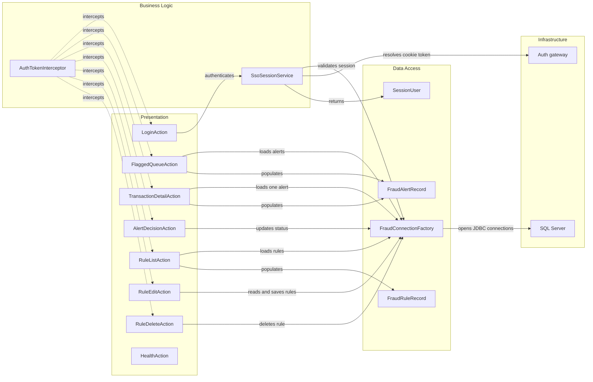

# Architecture Diagram

This repository contains a single deployable fraud analyst web application packaged as a WAR and hosted on Tomcat. The application uses Apache Struts 2 for request handling, direct JDBC access to SQL Server, and an external .NET authentication gateway for SSO token resolution.

## Application Architecture

### Technology Stack Summary

| Layer | Technology | Version | Purpose |
|---|---|---|---|
| Presentation | JSP and Struts tags | N/A | Server-rendered analyst UI |
| Web | Apache Struts | 2.5.30 | Action routing, interceptor stack, form handling |
| Runtime | Apache Tomcat | 9.0-jdk11 | Servlet container for the WAR deployment |
| Data Access | JDBC with SQLServerDriver | 12.8.1.jre11 | Direct SQL access without an ORM |
| Data Store | Microsoft SQL Server | N/A | Stores alerts, rules, accounts, transactions, and sessions |
| External Integration | ZavaAuthGateway WhoAmI | N/A | Resolves SSO cookie values into session tokens |

### Data Storage & External Services

The application uses a single SQL Server database for operational data, fraud rules, and session validation. It also depends on a separate HTTP-based authentication gateway to translate the `.ZAVAAUTH` cookie into a session token that the Java application can validate against the `SessionTokens` and `Users` tables.

### Key Architectural Decisions

- Uses a server-rendered Struts 2 MVC pattern with a custom authentication interceptor applied to most actions.
- Couples business actions directly to SQL queries through JDBC rather than using a service or repository abstraction layer.
- Relies on an external .NET authentication gateway to bridge cross-platform SSO cookie handling.

## Component Relationships

### Component Inventory

| Component | Layer | Type | Responsibility |
|---|---|---|---|
| AuthTokenInterceptor | Business Logic | Struts interceptor | Enforces session-based access for all non-login and non-health actions |
| SsoSessionService | Business Logic | Session service | Extracts tokens from request inputs and validates them against the DB or auth gateway |
| LoginAction | Presentation | Struts action | Accepts a session token and starts an authenticated analyst session |
| FlaggedQueueAction | Presentation | Struts action | Lists the newest fraud alerts awaiting analyst review |
| TransactionDetailAction | Presentation | Struts action | Shows alert details and review context for a selected alert |
| AlertDecisionAction | Presentation | Struts action | Records approve or reject decisions against an alert |
| RuleListAction | Presentation | Struts action | Lists configured fraud rules for analysts |
| RuleEditAction | Presentation | Struts action | Creates and updates fraud rules with simple validation |
| RuleDeleteAction | Presentation | Struts action | Deletes an existing fraud rule |
| HealthAction | Presentation | Struts action | Returns a simple online status page without auth |
| FraudConnectionFactory | Data Access | Connection factory | Creates direct JDBC connections using externalized configuration |
| FraudAlertRecord | Data Access | DTO | Carries alert data into the JSP views |
| FraudRuleRecord | Data Access | DTO | Carries rule data into the JSP views |
| SessionUser | Data Access | DTO | Carries authenticated user identity in the session |
