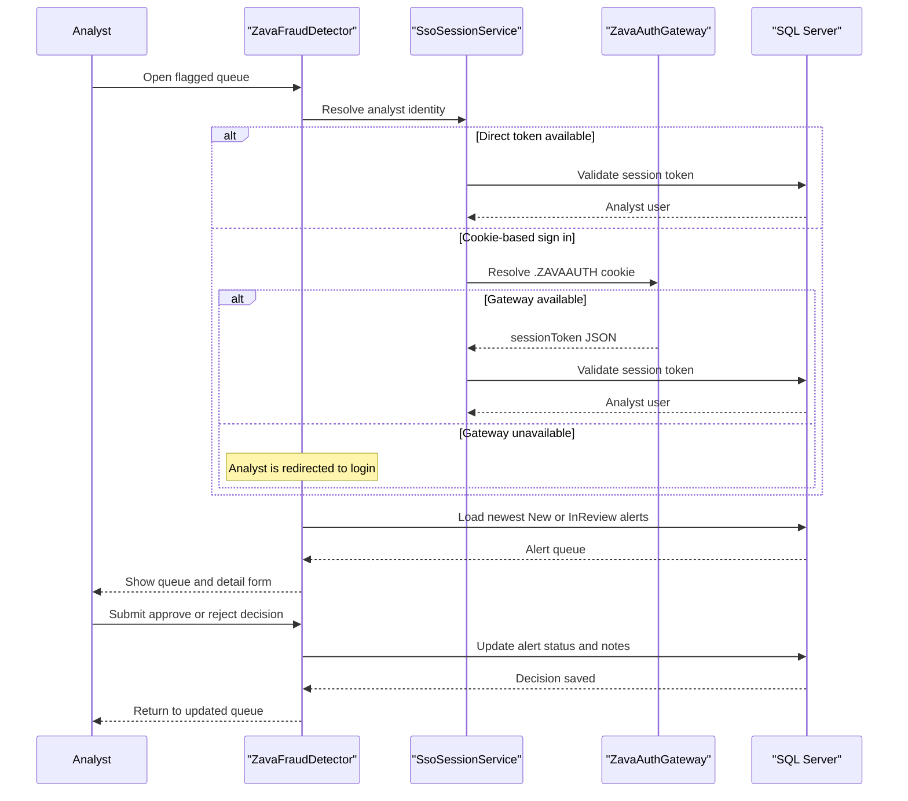

# Core Business Workflows

This application supports fraud analysts who investigate transaction alerts and maintain the rule set that drives fraud detection. Its main business flows revolve around secure analyst access, queue-based alert triage, decision capture, and rule administration.

## Domain Entities

| Entity | Service / Bounded Context | Description | Key Relationships |
|---|---|---|---|
| Fraud Alert | Fraud Operations | A flagged transaction awaiting analyst review or resolution | Links to account and transaction data; updated by analyst decisions |
| Fraud Rule | Fraud Operations | A configurable rule that describes how suspicious activity is detected | Maintained by analysts and referenced conceptually by alert generation |
| Session User | Identity and Access | Authenticated analyst identity stored in the session | Derived from session token validation |
| Session Token | Identity and Access | Credential that proves the analyst session is active | Belongs to a user and may originate from the auth gateway cookie flow |
| Account | Core Banking Reference | Customer account tied to a fraud alert | Joined into alert views |
| Transaction | Core Banking Reference | Monetary activity behind a fraud alert | Joined into alert views |

## Service-to-Domain Mapping

| Service | Domain Context | Owned Entities | External Dependencies |
|---|---|---|---|
| ZavaFraudDetector | Fraud Operations | Fraud Alert, Fraud Rule, Session User view model | SQL Server, ZavaAuthGateway |
| ZavaAuthGateway | Identity and Access | Session token resolution only | .NET auth infrastructure |
| SQL Server | Persistence | FraudAlerts, FraudRules, Accounts, Transactions, SessionTokens, Users | None |

## Primary Workflows

### Workflow 1: Analyst signs in

An analyst reaches `login.action` and submits a session token, or the application extracts a token from the request headers or cookie. `SsoSessionService` validates the token against the `SessionTokens` and `Users` tables, stores a `SessionUser` in the Struts session, and redirects the analyst to the flagged alert queue. If validation fails, the login form returns an error.

### Workflow 2: Analyst reviews and resolves a fraud alert

An authenticated analyst opens `flaggedQueue.action`, which loads up to 100 alerts with `New` or `InReview` status ordered by newest first. From the queue, the analyst opens `transactionDetail.action`, inspects the alert context, then submits `alertDecision.action` with `Approved` or `Rejected` plus optional notes. The decision flow updates alert status, resolution notes, and timestamps in SQL Server.

### Workflow 3: Analyst maintains fraud rules

An authenticated analyst opens `rules.action` to review the configured rule set. The analyst can create a rule, edit an existing rule, or delete a rule, and `RuleEditAction` applies simple validation to require a name and severity while parsing optional threshold and time-window values before saving.

## Cross-Service Data Flows

The application is not decomposed into multiple source-built services, so most business flows stay inside one Java web app backed by one database. The only cross-service data flow is the cookie-based SSO path: the Java application forwards the `.ZAVAAUTH` cookie to the auth gateway, extracts a `sessionToken` from the response, and then validates that token locally in SQL Server. If the gateway is unavailable, cookie-based sign-in degrades and the analyst must provide a direct session token.

## Business Workflow Sequence

## Business Rules & Decision Logic

- Protected workflows require an authenticated `SessionUser`; only `login` and `health` bypass the custom interceptor.
- Alert queue processing is limited to alerts whose status is `New` or `InReview`, ordered by most recent creation time.
- `AlertDecisionAction` maps only the literal `Approved` value to an approved state; any other non-empty decision is treated as `Rejected`.
- Rule maintenance requires a non-empty rule name and severity, while threshold amount and time window must parse as numeric values when provided.
- Alert decision updates append analyst identity text to the resolution notes, creating a lightweight audit trail.
