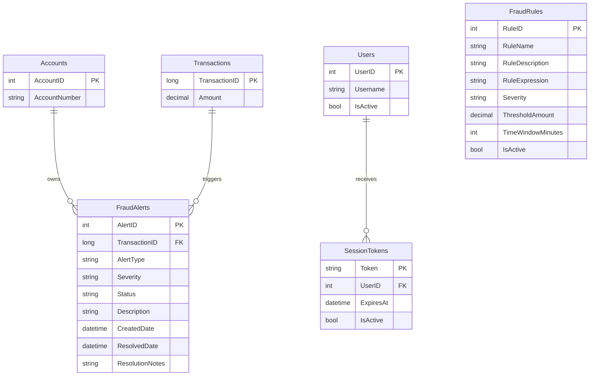

# Data Architecture & Persistence Layer

The data layer consists of a single SQL Server database accessed through raw JDBC, plus a handful of mutable record classes that mirror result sets for the JSP views. No ORM, repository framework, schema migration tool, or cache provider is present.

## Database Configuration

| Service/Module | DB Type | Profile | Driver | Connection | Migration Tool |
|---|---|---|---|---|---|
| ZavaFraudDetector | SQL Server | Default | Microsoft JDBC Driver 12.8.1.jre11 | `jdbc:sqlserver://sqlserver:1433;databaseName=ZavaBankDB;encrypt=false;trustServerCertificate=true` with environment overrides | None detected |

## Data Ownership per Service

| Service | Tables Owned | ORM Framework | Caching | Notes |
|---|---|---|---|---|
| ZavaFraudDetector | FraudAlerts, FraudRules, Accounts, Transactions, SessionTokens, Users | None, direct JDBC | None | Single shared operational database for alert review, rule admin, and session validation |

## Entity Model

## Key Repository Methods

| Service | Repository | Notable Methods | Purpose |
|---|---|---|---|
| ZavaFraudDetector | `FraudConnectionFactory` | `openConnection()` | Creates a new JDBC connection for every request path |
| ZavaFraudDetector | `SsoSessionService` | `resolveSessionUser(HttpServletRequest, String)` | Validates a token against `SessionTokens` and `Users` |
| ZavaFraudDetector | `FlaggedQueueAction` | Inline `SELECT TOP 100 ... FROM FraudAlerts ...` | Loads open alert queue rows with joined account and transaction data |
| ZavaFraudDetector | `TransactionDetailAction` | Inline `SELECT TOP 1 ... WHERE fa.AlertID = ?` | Loads a single alert for analyst review |
| ZavaFraudDetector | `AlertDecisionAction` | Inline `UPDATE FraudAlerts SET Status = ?, ResolutionNotes = ? ...` | Persists analyst approval or rejection decisions |
| ZavaFraudDetector | `RuleListAction` | Inline `SELECT ... FROM FraudRules ORDER BY RuleID` | Lists all configured fraud rules |
| ZavaFraudDetector | `RuleEditAction` | Inline `INSERT` and `UPDATE` statements for `FraudRules` | Creates and updates fraud rules |
| ZavaFraudDetector | `RuleDeleteAction` | Inline `DELETE FROM FraudRules WHERE RuleID = ?` | Removes a rule |

## Caching Strategy

No application cache was detected. Every action opens a fresh JDBC connection and executes live SQL, while authenticated identity is cached only in the Struts HTTP session after successful token resolution. There is no cache-aside, distributed cache, second-level cache, or query result cache configuration.

## Data Ownership Boundaries

The application uses a single shared database and does not separate read and write models. Cross-domain access happens through direct table joins inside the Struts action classes rather than through service APIs or repository abstractions. Session validation, alert review, and rule management all read and write the same store, so the application treats the database as the integration boundary.

### Data Classification & Sensitivity

| Entity | Sensitive Fields | Classification | Controls in Place |
|---|---|---|---|
| Accounts | `AccountNumber` | PII and financial identifier | No masking detected in storage or views |
| Transactions | `Amount` | Financial data | No special controls detected |
| Users | `Username` | PII | Session-based access only |
| SessionTokens | `Token` | Sensitive credential | Expiry and active-state validation only |
| FraudAlerts | `Description`, linked account and transaction data | Confidential operational data | No encryption or masking detected |
| FraudRules | Rule definitions and thresholds | Internal | No special controls detected |
