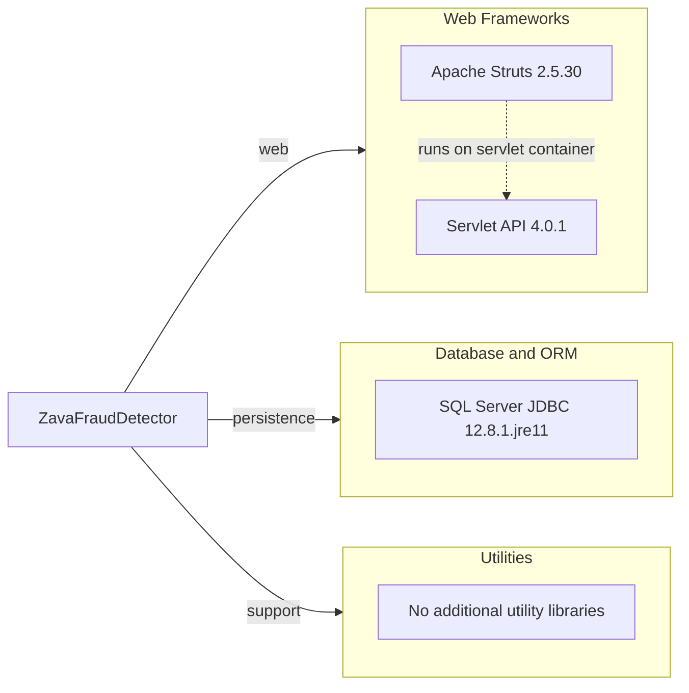

# Dependency Map

This project declares three production dependencies and no explicit test dependencies in Gradle. The dependency set is compact and centers on a legacy Struts web stack, SQL Server connectivity, and servlet container APIs.

## Dependencies

### Dependency Summary

| Category | Count | Key Libraries | Notes |
|---|---:|---|---|
| Web Frameworks | 2 | Apache Struts 2.5.30, Servlet API 4.0.1 | Legacy MVC stack packaged as a WAR |
| Database and ORM | 1 | Microsoft SQL Server JDBC 12.8.1.jre11 | Direct JDBC driver with no ORM abstraction |
| Utilities | 0 | None | The application relies mostly on JDK classes |

### Version & Compatibility Risks

The project depends on Apache Struts 2.5.x and `javax.servlet` APIs, which increases migration effort for newer Jakarta-based Java runtimes and modern frameworks. The application is also tightly coupled to a Tomcat WAR deployment model and SQL Server-specific JDBC connectivity, which adds cloud-hosting and portability work.

### Notable Observations

- There is no dependency for testing, connection pooling, validation, or observability declared in Gradle.
- The web tier is framework-heavy relative to the overall code size because request handling depends on Struts XML configuration and JSP tags.
- SQL access is handled directly through the JDBC driver, so database portability and dependency injection support are limited.

## Test Dependencies

| Framework | Version | Notes |
|---|---|---|
| None detected | N/A | No test-scoped dependencies are declared in `build.gradle` |

Total test-scope dependencies: 0
No test dependencies were detected, and the repository also lacks a Gradle wrapper. Existing validation depends on the local Gradle installation and currently fails before tests execute.
